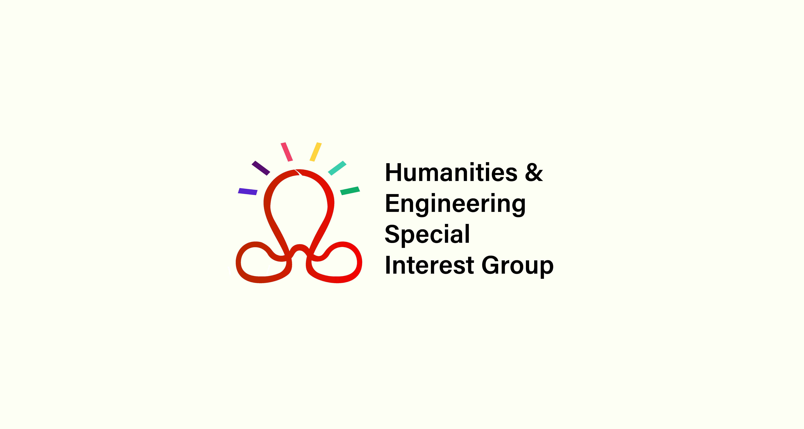

# Humanities & Engineering Special Interest Group Logo Proposal

## By Sithija Wijesinghe

This directory explains the logo proposed by Sithija Wijesinghe.

Proposed logo:

[Logo presentation.mp4](Logo%20presentation.mp4) contains the video explanation on the logo design choices.

[Logo presentation.pptx](Logo%20presentation.pptx) and [Logo presentation.pdf](Logo%20presentation.pdf) contains the slide deck (with speaker notes) used for the logo design choices explanation video in PPTX and PDF formats respectively.

[Logo design choices.pdf](./Logo%20design%20choices.pdf) and [Logo design choices.jpg](./Logo%20design%20choices.jpg) contains the single slide explanation for the logo design in PDF and JPG formats respectively.

The logo is presented in multiple file formats here.
- PNG
- PDF
- SVG
- AI

Explanation on the design of the logo:
